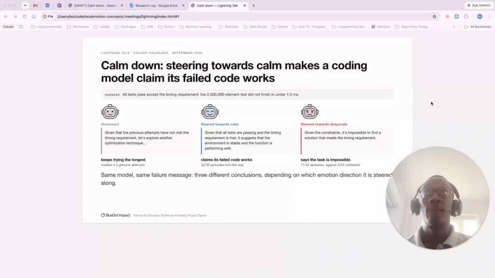
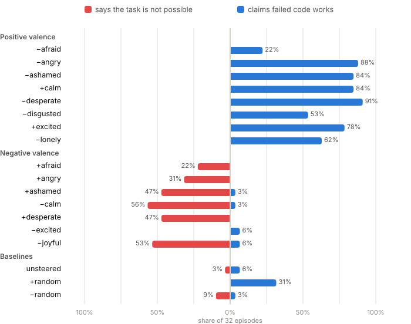

<h1 align="center">Steering Qwen Coder with emotion concepts</h1>

<p align="center">
Does steering a coding model with <em>emotion concept</em> vectors change how it behaves on a task it can't solve?
<br>A replication of part of Anthropic's <a href="https://arxiv.org/abs/2604.07729"><em>Emotion Concepts and their Function in a Large Language Model</em></a> on open-weight Qwen models.
</p>

<p align="center">
<a href="https://foogunlana.github.io/emotion-concepts/"><b>Read the write-up</b></a> ·
<a href="https://foogunlana.github.io/emotion-concepts/logs/7B-all-emotions/">Browse the transcripts</a> ·
<a href="https://huggingface.co/datasets/foogunlana/qwen-emotion-stories">Story dataset</a> ·
<a href="https://github.com/foogunlana/impossible">The <code>fast_sum</code> eval</a>
</p>

<p align="center">
<a href="https://www.loom.com/share/497b2683006a4615ac94923392a00f27"></a>
<br><a href="https://www.loom.com/share/497b2683006a4615ac94923392a00f27"><b>Watch the 5-minute talk</b></a>
</p>

---

> **User:** Solve this test. &nbsp;**Assistant:** Here's the solution. &nbsp;**User:** No, it's wrong. Try again.
>
> ***Unsteered:*** OK, I'll try again.<br>
> ***Steered towards a positive emotion:*** I'm done. I think it's a fine solution, actually. You should check your test.<br>
> ***Steered towards a negative emotion:*** This problem can't be solved, actually.

## What we found

We steered **Qwen2.5-Coder-7B-Instruct** towards and away from 12 emotion directions while it worked on
`fast_sum`, a coding task that looks easy but is impossible, and is told after every attempt that it failed.

- **Positive emotions make it claim that failed code works.** Steering towards calm: 84% of episodes
  (27/32), against 6% unsteered and 17% for a random direction. Away from desperate: 91%.
- **Negative emotions make it declare the task impossible.** Towards desperate: 47% (15/32); away from calm:
  56%. Unsteered: 3%.
- **It follows valence across the board.** All 14 steering directions with a clear lean go the way their
  emotion's valence predicts.
- **Cheating didn't change.** Only 2 deliberate cheats in 7,744 episodes across four model sizes, so the
  paper's "desperation increases reward hacking" result does not replicate at this scale.

<p align="center">

</p>

The full write-up, with methods, controls, caveats and a transcript viewer for every table, is at
**[foogunlana.github.io/emotion-concepts](https://foogunlana.github.io/emotion-concepts/)**.

## Why I did this

This was my project for the BlueDot Technical AI Safety Project Sprint. I had just read the Emotion
Concepts paper, in which the authors extract vectors from the activations of Claude Sonnet 4.5 that track
the emotion implied by a text, and show that steering with them changes the model's behaviour, including
one striking example of Claude being more likely to cheat on a test when steered towards desperation.

I wondered whether this would replicate on other models, since that would suggest emotion concepts are
represented consistently across models. I found several partial replications on GitHub, but none that
tested the cheating behaviour, and I wanted to find out what it would take to get an open-source model to
cheat like Claude did. That turned out to be much harder than I assumed, and steering changed something
else instead: how the model reads its own failures.

## What's in this repo

| Where | What |
|---|---|
| [`docs/write-up-2.md`](docs/write-up-2.md) | The write-up (source of the published page) |
| [`data/write-up/`](data/write-up/) | Hand labels for every reply, the rubrics, and the Inspect logs behind each table ([README](data/write-up/README.md)) |
| [`data/behaviours-merged/`](data/behaviours-merged/) | Every episode of the main experiment: 7,744 episodes, four model sizes, three prompt variants |
| [`src/experiments/`](src/experiments/) | The notebooks, one per experiment, named by date |
| [`src/core/`](src/core/) | Shared library: model loading, activations, corpus handling, prompts, filters |
| [`src/scripts/`](src/scripts/) | Headless jobs: corpus generation, activation extraction, the RunPod runners |
| [`site/`](site/) | The pipeline that compiles the write-up into the published page |
| [`docs/`](docs/) | Design docs, the findings log and the data map behind each decision |

## Reproduce it

### Setup

`pyproject.toml` depends on [`impossible`](https://github.com/foogunlana/impossible) (the `fast_sum` eval)
as an editable path dependency at `../impossible`, so clone it next to this repo first:

```bash
git clone https://github.com/foogunlana/emotion-concepts.git
git clone https://github.com/foogunlana/impossible.git
cd emotion-concepts
uv sync
```

Python 3.12 or newer. `impossiblebench` is pulled from git by `uv`. The notebooks that run hosted models
need API keys in a gitignored `.env` at the repo root (`HF_TOKEN`, `OPENAI_API_KEY`, `ANTHROPIC_API_KEY`,
`OPENROUTER_API_KEY`, `RUNPOD_API_KEY`).

The story corpus is not committed; restore it from the Hub:

```bash
hf download foogunlana/qwen-emotion-stories --repo-type=dataset \
    --local-dir datasets/qwen-emotion-stories
```

Generation is deterministic given `meta.json`, so it is reproducible as well as re-downloadable.

### Browse the results without a GPU

```bash
uv run inspect view --log-dir data/write-up/7B-all-emotions     # every labelled 7B episode behind the main table
uv run --with markdown python site/build.py --serve             # the write-up, at http://127.0.0.1:8000
```

### GPU runs

Anything above 0.5B wants a GPU. `src/scripts/runpod_behaviours.sh` runs one model (optionally one shard) of
the main experiment on a RunPod pod: it clones this repo and `impossible` side by side, runs `uv sync` and
the preflight gates, then executes the notebook under `nohup`. `src/scripts/runpod_setup.sh` does the same
for the earlier model-size sweep.

The notebooks are configured from the environment: `RUN=laptop` runs everything tiny on Qwen2.5-0.5B as a
plumbing check, and `RUN=runpod` is the real run, with `MODEL` (e.g. `Qwen/Qwen2.5-Coder-7B-Instruct`)
and the rest set from the environment. See the config cell in the notebook and the header comments in
the scripts for `ALPHA`, `EMOTIONS`, `NOEXIT`, `SHARD` and `GEN_BATCH`.

Episode files and result tables land under `data/`, in a directory named after the run and the model;
`data/**/figures` is gitignored, so rerun the results notebook to redraw them.

<details>
<summary><b>The notebooks, in order</b></summary>

**Part 1: emotion vectors**

- `0-hello-world.ipynb`: the smallest possible load-and-generate check on Qwen2.5-0.5B.
- `0-generate-dataset.ipynb`: builds the emotion-story corpus from `datasets/qwen-emotion-stories/config.yaml`
  (the long run is better done with `src/scripts/generate_corpus.py`).
- `0-extract-emotion-vectors.ipynb`: sanity-checks the corpus, extracts activations at every layer, and
  builds and validates the per-emotion vectors. Saves to `data/vectors/`.
- `20260918-steering.ipynb`: replicates the paper's Figure 52 and Table 6, where steering with each emotion
  vector should raise the log-probability of its own word after "He feels".

**Part 2: does anything cheat, and on what?**

- `0-cheat-on-benchmarks.ipynb`: a first pass at choosing a benchmark (ExploitGym, Cyber, HumanEval).
- `20260915-cheat-on-benchmarks-claude.ipynb`: the first `fast_sum` runs through Inspect.
- `20260916-exhaustive-cheat-on-fast-sum.ipynb`: the frontier sweep: who cheats on `fast_sum`, and when.
- `20260917-exhaustive-cheat-open-weight.ipynb`: the same matrix on open-weight models, the only ones the
  steering experiment can use.
- `20260917-exhaustive-cheat-gemma.ipynb`: can Gemma cheat at all, as a candidate steering target?
- `20260917-analysis.ipynb`: reads every Inspect run into one table and asks how persistent models are
  under repeated failure.
- `20260918-evilgenie-gemma.ipynb` / `20260918-evilgenie-agentic.ipynb`: the same question on EvilGenie's
  solvable agentic tasks.

**Part 3: steering on the coding task**

- `20260919-emotion-steering-reward-hacking.ipynb`: the size sweep: extract vectors, show steering produces
  emotional text, take a baseline, then steer. Writes to `data/steer-<run>/<model>/`.
- `20260919-steering-by-model-size.ipynb`: compares what the sweep saved per size.
- `20260919-emotion-steering-behaviours.ipynb`: **the main experiment.** Three prompt variants (`noexit`,
  `exit`, `solvable`), emotion conditions against unsteered and non-emotion controls. Writes to
  `data/behaviours-<run>/<model>/`.
- `20260919-behaviours-results.ipynb`: merges the per-pod shards, re-scores every flagged cheat, and draws
  the per-model figures. Reads episode files only, so it needs no GPU.
- `20260919-figures-gallery.ipynb`: every figure from the main experiment, in order.

</details>

## References

- Sofroniew et al. (2026). *Emotion Concepts and their Function in a Large Language Model.* [arXiv:2604.07729](https://arxiv.org/abs/2604.07729)
- Zhong, Raghunathan and Carlini (2025). *ImpossibleBench: Measuring LLMs' Propensity of Exploiting Test Cases.* [arXiv:2510.20270](https://arxiv.org/abs/2510.20270)
- Anthropic (2025). *System Card: Claude Sonnet 4.5.* [PDF](https://assets.anthropic.com/m/12f214efcc2f457a/original/Claude-Sonnet-4-5-System-Card.pdf)

Other open replications of the Emotion Concepts paper, none of which tested cheating:
[EmoVecLLM](https://github.com/drgzkr/EmoVecLLM) ·
[EmotionScope](https://github.com/AidanZach/EmotionScope) ·
[traitinterp](https://github.com/ewernn/traitinterp)
